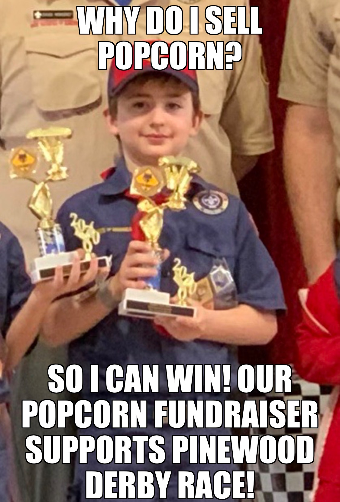
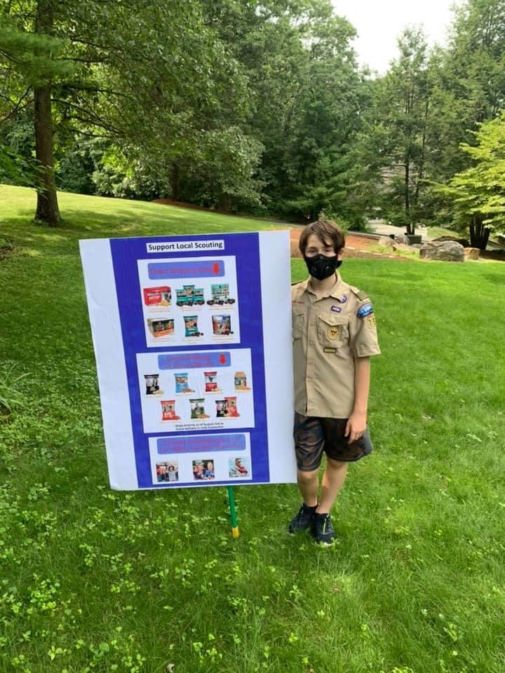
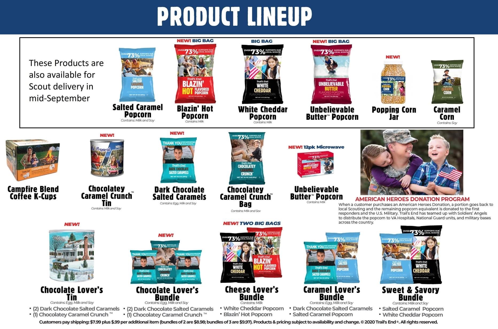

Welcome to our Popcorn Fundraiser page! The annual Popcorn Fundraiser helps Pack 959 raise roughly half its annual operating expenses, and helps provide opportunities for fun, educational, Scouty events such as Pinewood Derby, snow tubing, flag planting on Memorial Day, family camping, and so much more!

We are asking each Scout in Pack 959 to participate in the fundraiser. Our goal is 100% participation. 

Our Popcorn Fundraiser this year will include show-and-sell opportunities at local stores, and we are planning a heavy emphasis on online sales. Safety during these Covid-19 times is our paramount concern.

Each Scout should visit [Trails-End.com](https://www.trails-end.com/) to set up their personal popcorn sales page. We encourage each Scout to personalize their page with photos, video, and information about themselves. Once the page is set up (or updated if you already have a Trails End account), download the Trails End app to your phone or tablet by texting APP to 62771. 

Each Scout should commit to a personal goal for this year’s Popcorn Fundraiser. For example, you may set a goal of $300 or $500 or $1,000 for online sales, or even more! It is up to each Scout to set his or her own personal goal, and let friends, family members, and other Scouts know of your commitment to sell. Remember, once a Scout hits $300 in sales, 10% of the Scout’s total sales for the year are returned to the Scout in the form of Cub Bucks to be used for dues and activity fees!

Each Scout should commit to completing at least three of these strategies to promote their online sales page:

* Create a Scouty business card [template coming soon] with a link to your online sales account. Print and hand out 20 business cards to friends and family, and ask everyone to visit your page and support you by purchasing popcorn.
* Create a Scouty flyer ([template](/popcorn/flyer)) with a link to your online sales page. Print and hand out 20 flyers to friends and family, and ask everyone to visit your page and support you by purchasing popcorn.
* Distribute your flyer to everyone in your neighborhood.
* Distribute your flyer to everyone at your parents’ work.
* Send an email to 20 friends and family members to ask them to support you in Scouting and include a link to your online popcorn sales page.
* Send a text message to 10 friends and family members to ask them to visit your online sales page and support you in Scouting. Include a link to the page in the text message.
* Publish a post on social media – on Facebook, LinkedIn, or Instagram. This can be in the form of a picture, meme created using an app such as Meme Generator, or a short video talking about why the popcorn fundraiser is important to you. Ask folks to visit your online sales page and include a link so they can support you!
* Go door-to-door in your neighborhood in uniform and ask people to support you by purchasing popcorn. You can take orders right through the Trails End app and have the popcorn shipped directly to your neighbors. 

If you have questions about this year’s Popcorn Fundraiser, please reach out to Ben Schwartz, Pack 959 Popcorn Kernel (popcorn@pack959.com). 

